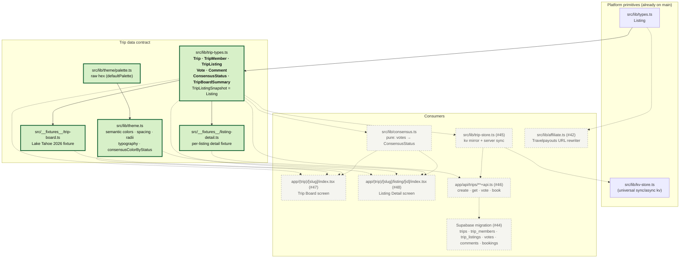
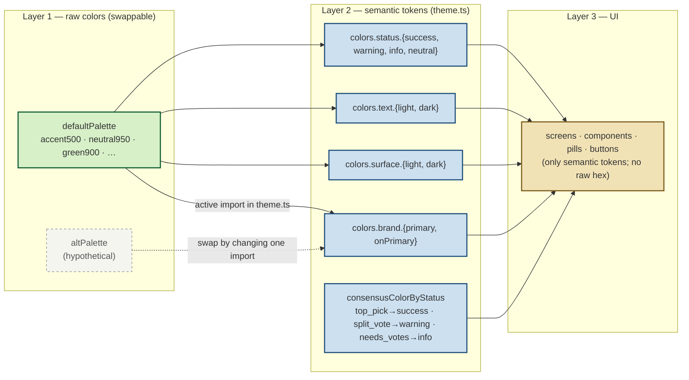
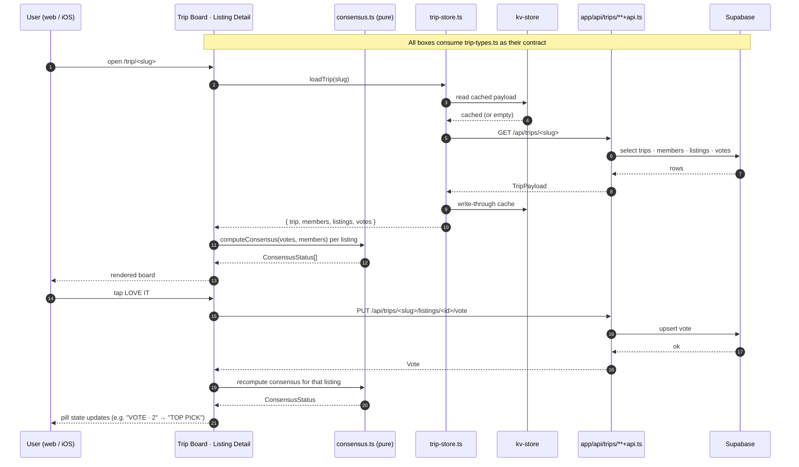

# Trip data model — architecture

Long-lived reference for how the **group trip-planning data model** is
layered in this codebase, and how UI screens, server code, and the
Supabase schema relate to it.

Companion to [`../superpowers/plans/2026-05-19-post-search-booking-flow.md`](../superpowers/plans/2026-05-19-post-search-booking-flow.md).
That plan is the *spec*; this doc is the *map*.

Diagrams are Mermaid. View in:

- **PyCharm / IntelliJ:** open this file → click the preview pane
  (top-right split icon). Bundled Markdown plugin renders Mermaid; the
  optional JetBrains **Mermaid** plugin adds zoom + export.
- **VS Code:** "Markdown Preview Mermaid Support" extension, or just
  push the branch and view on GitHub (native rendering).
- **Browser:** paste into <https://mermaid.live>.

---

## 1. Module layering

Solid arrows = real imports. Dashed arrows = planned imports (issue
referenced on the edge). The green-bordered modules form the **stable
contract** that every M1 UI/server task depends on.

### Rules of thumb

- **UI screens import from exactly three places:** `trip-types`,
  `theme`, and one fixture (until the live store + API land).
- **`src/server/**` is the secret boundary** (enforced by ESLint). The
  trip data contract is universal — types and fixtures must NEVER
  import from `src/server`. Server code may import the contract.
- **Snapshot reuse:** `TripListingSnapshot = Listing`. Today a 1:1
  alias; if `Listing` later changes shape, version the snapshot here
  rather than fixing every fixture call site.

---

## 2. Theme & palette — the swap mechanism

Two files so the palette can be iterated cheaply. UI code must never
reference raw hex.

### Changing the palette

1. **Tweak in place** — edit values in `src/lib/theme/palette.ts →
   defaultPalette`. One file, zero UI changes.
2. **A/B alternate** — add another `Palette` export, change the import
   line in `theme.ts`. Still one file.
3. **Re-skin consensus** — edit `consensusColorByStatus` in `theme.ts`.
   No UI changes.

Status colors are intentionally generic
(`success`/`warning`/`info`/`neutral`). Trip-domain mapping lives in
`consensusColorByStatus` so the theme stays reusable for non-trip UI.

---

## 3. Runtime data flow

How a user opening a trip and casting a vote moves through the layers.
Everything below `trip-types.ts` consumes it as its contract.

### Caching contract

- `trip-store.ts` is the only thing that reads/writes `kv-store` for
  trip data. Screens always go through the store, never directly to
  the API or to kv.
- Cache shape mirrors the contract types exactly — kv stores
  `{ trip: Trip, members: TripMember[], listings: TripListing[],
  votes: Vote[] }`. No projection layer.
- Writes are optimistic: store updates the kv copy first, fires the
  API call, rolls back on failure.

---

## 4. Mapping to Supabase

The TS contract and the SQL schema are 1:1 by design. Renames must
happen on both sides simultaneously.

| TS interface       | SQL table        | Notes |
|--------------------|------------------|-------|
| `Trip`             | `trips`          | `slug` is the public share-link key. |
| `TripMember`       | `trip_members`   | The cookie-bound `member_token` is sha256-hashed into `member_token_hash` server-side; clients never see it and the TS `TripMember` contract therefore omits it. `userId` lands with #74. |
| `TripListing`      | `trip_listings`  | `listingSnapshot` is `jsonb`, frozen at add time. |
| `Vote`             | `votes`          | PK = (`trip_listing_id`, `trip_member_id`). |
| `Comment`          | `comments`       | M2 surface. |
| `ConsensusStatus`  | *(computed)*     | Never persisted. Pure function of `votes` + member count. |
| `TripBoardSummary` | *(computed)*     | Derived counts for the board header. |

RLS lives with the migration issue (#44). Anon access is intermediated
by an Edge Function minting a short-lived JWT keyed off the member
cookie — the anon Supabase key is never used directly from clients.
